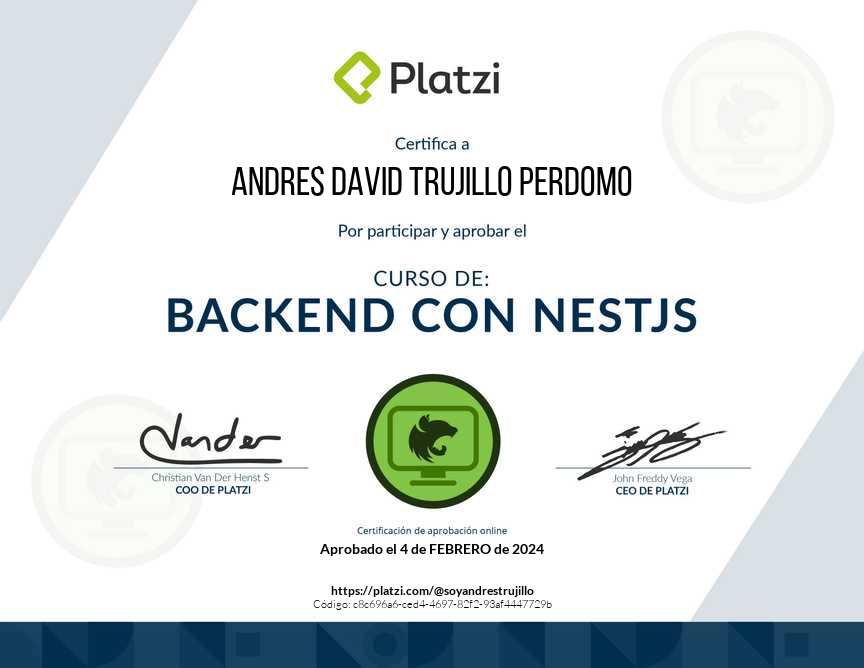
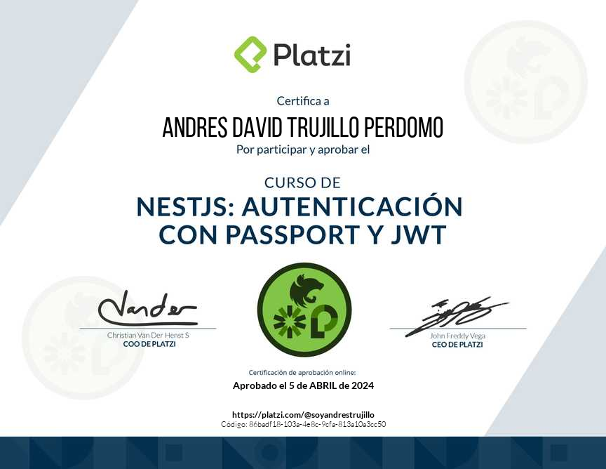
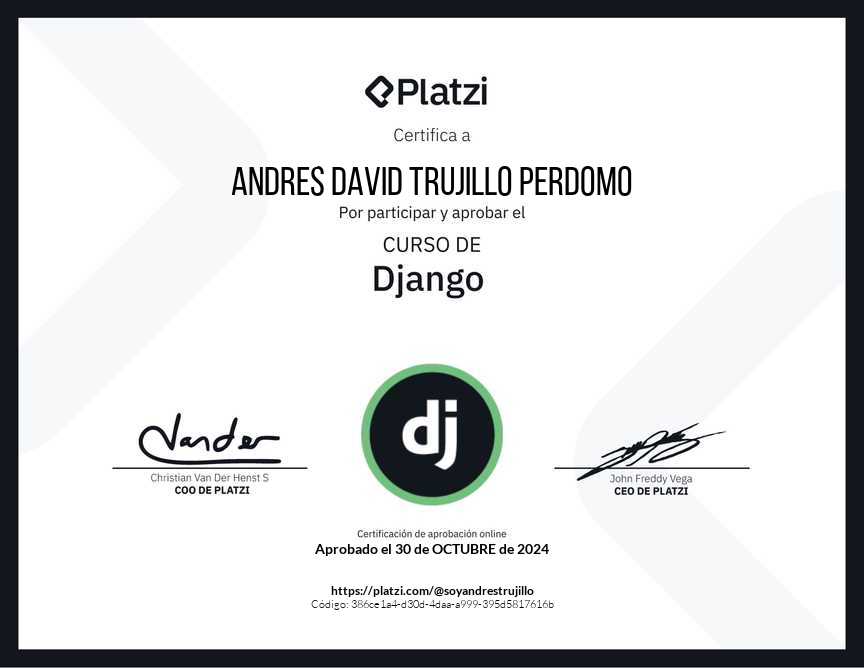
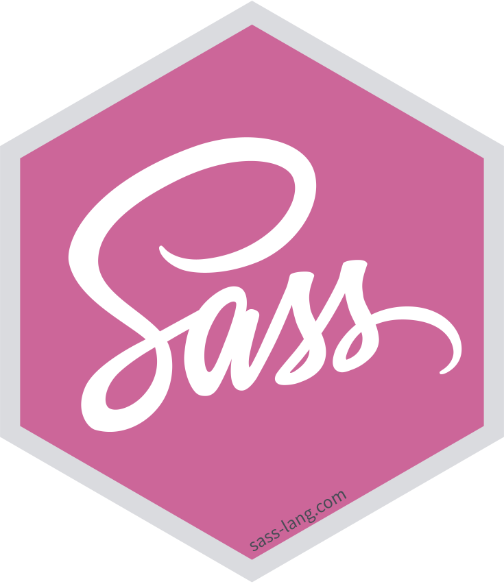

<h1 align="center">🧑🏼‍💻 Hola, soy Andres Trujillo</h1>
<h3 align="center">Ingeniero de software | Uninpahu </h3>

##  Sobre mi
- 🎓 Estudiante de **Ingeniería De Software** en la Universidad Universitaria Uninpahu (Bogotá, Colombia).
- 🎓 Egresado de **Desarrollo de Software** en el SENA (Bogotá, Colombia).
- 💼 **Full Stack Developer en [Conexis](https://www.conexisvmssoftware.com/)**, hago realidad los sueños de la startup con código.
- 🚀 Software Developer para **[HR Solutions](https://hrsolutions.com.co/)** — especializado en **Angular, CSS, Python, Django, NodeJS, ExpressJs, Postgrest, Go, RESTful APIs, SOLID principles**.
- 🚀 Software Developer para **[Fluvip](https://www.fluvip.com/)** — especializado en **ReactJS, Ruby, SASS, Postgrest**.
- ⚙️ Cree una landing page llamada [Diplomado](https://diplomado.fluvip.com/) de mentorias para influencer y speakers.
- ✨ Apasionado por los LLM's y creación de software: enfocado a creación de **LLM's**, software scalable, dinámico y concurrente.

##  Certificaciones

## Contacto

  
  
  

## Skills

  <!-- Frontend -->
  <p1>Frontend</p1>

  
  
  
  
  
  
  

  <!-- Backend -->
   
   
  <p1>Backend</p1>

  
  
  
  

  <!-- Databases -->
   
   
  <p1>Databases</p1>

  
  
  

  <!-- Tools & OS -->
   
   
  <p1>Tools & OS</p1>

  
  
  
  
  

   
   
  <p1>Others:</p1> RESTfull API, Microservices, SOLID principles, Git, DevOps, Docker, OOP , Unit TesOng, IntegraOon TesOng.

 

 

